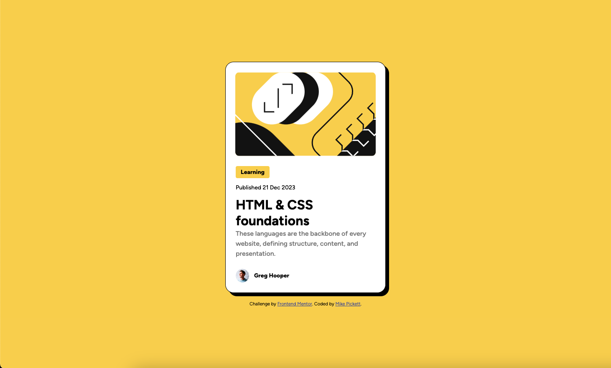

# Frontend Mentor - Blog preview card solution

This is a solution to the [Blog preview card challenge on Frontend Mentor](https://www.frontendmentor.io/challenges/blog-preview-card-ckPaj01IcS). Frontend Mentor challenges help you improve your coding skills by building realistic projects. 

## Table of contents

- [Overview](#overview)
  - [The challenge](#the-challenge)
  - [Screenshot](#screenshot)
  - [Links](#links)
- [My process](#my-process)
  - [Built with](#built-with)
  - [What I learned](#what-i-learned)
  - [Continued development](#continued-development)
- [Author](#author)

## Overview

### The challenge

Users should be able to:

- See hover and focus states for all interactive elements on the page

### Screenshot

### Links

- [Frontend Mentor Link](https://www.frontendmentor.io/solutions/blog-preview-card---html-css-JE3b_tMhOv)
- [MikePickett.dev Link](https://mikepickett.dev/blog-preview-card-final/)

## My process

### Built with

- Semantic HTML5 markup
- CSS custom properties
- Flexbox
- Mobile-first workflow

### What I learned

Mostly I learned where to find some things in Figma when working from a design. Overall the layout was fairly simple, however it's important to be sure you have fonts in the design installed on your system. I was also a little surprised with this design that I didn't have to look up any CSS concepts, I was able to implment CSS variables for the colors and transitions on the hover effects. 

### Continued development

I am going to continue to work on finding new CSS styling options as I feel like some of the techniques I'm using may be a little outdated. 

## Author

- Website - [Mike Pickett](https://www.mikepickett.dev)
- Frontend Mentor - [@gmdpickett](https://www.frontendmentor.io/profile/yourusername)
